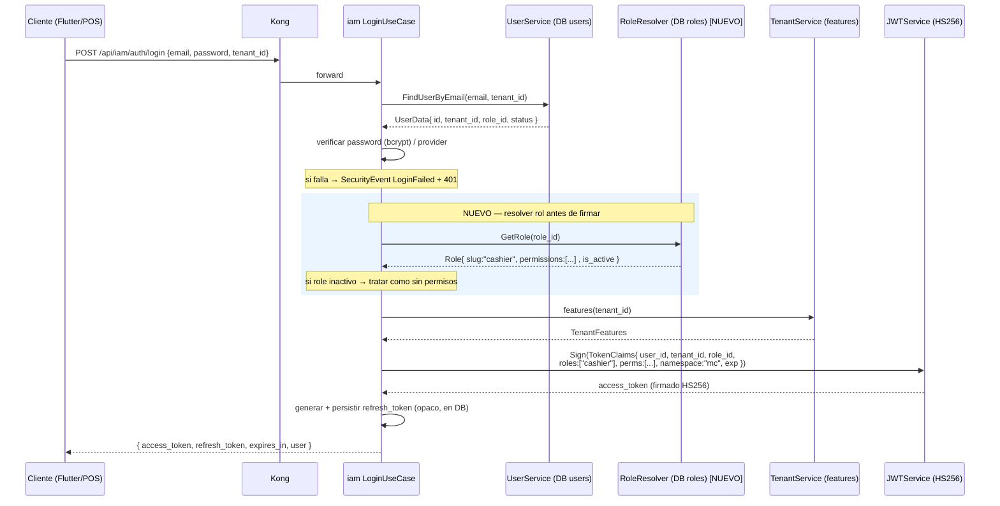
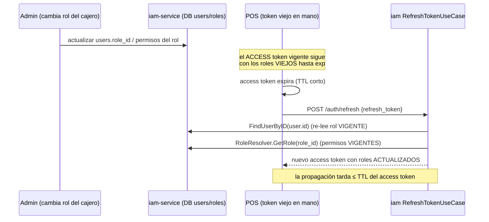

# Design Doc: Emisión de roles en el JWT (RBAC del ecosistema)

> **ESTADO DE IMPLEMENTACIÓN (2026-06-17):** Fases 1, 2 y 4 IMPLEMENTADAS y con build+tests verdes en toda la flota (13 módulos).
> - **Fase 1** (iam emite `roles`/`perms`): migración `011_add_slug_to_roles.sql` (índice parcial para slug de sistema), `RoleResolver` (puerto con tipo propio + adapter SQL), login/refresh pueblan claims con fail-closed (`role_claims.go` + test).
> - **Fase 2** (go-shared): `RequireRole`/`RequirePermission` en `require_role.go` (+ tests, incl. C3: el comodín `*` no aprueba `approve_review`).
> - **Fase 4** (cierre de bypass): flag `RejectMissingTenant` en `tenant_validation.go` (default preserva comportamiento, NO big-bang). **C1**: emisor S2S de onboarding ahora firma `tenant_id`+`namespace` (`NewServiceTokenProviderWithIdentity`); script de 365d endurecido. **C2**: sales con `Namespace:"mc"` + `RejectMissingTenant:true`.
> - **Fase 3** (enforcement en endpoints de caja): BLOQUEADA — los endpoints de caja (Tramo A) no existen aún (solo ADR-003). Al construirlos: cablear `RequireRole`, `approve_review` con `RequireRole("supervisor")` exacto, y regla aprobador≠operador + audit (C4).
> - **Deuda de rollout**: invertir el default de `RejectMissingTenant` a fail-closed una vez tightened todos los consumidores S2S servicio por servicio.

**Estado:** Diseño aprobado — Fases 1/2/4 implementadas (ver arriba)
**Ceremony level:** L4 (toca auth; prerequisito de un flujo de dinero)
**Fecha:** 2026-06-17
**Autor:** @dev-technical-leader
**Decisión de owner:** aprobada 2026-06-17 (ADR-003 sales-service, decisión #2)
**Bloqueante de:** E18 Tramo A — gate de seguridad de caja (ADR-003 sales-service, bloqueante #1 y #3)
**Alcance de esta tarea:** SOLO diseño y documentación. No se implementa el cambio todavía.

---

## 1. Contexto y problema

@dev-security verificó que **NO existe RBAC en el ecosistema mercado-cercano**:

- El JWT que emite `iam-service` ya lleva un claim `role_id` (UUID), pero **ningún servicio downstream lo lee**, y el UUID por sí solo no dice nada (no trae nombre de rol ni permisos).
- El middleware compartido `libs/go-shared/infrastructure/middleware/tenant_validation.go` guarda los claims completos en el contexto Gin (`c.Set("jwt_claims", claims)`), pero **ningún controller los consume para autorizar**. El resultado: cualquier usuario autenticado del tenant puede hacer cualquier cosa.
- La caja POS (ADR-003) es L4 (efectivo real) y exige roles `cashier` y `supervisor` **firmados en el JWT** para separar funciones (el cajero nunca aprueba su propio descuadre).

Este doc diseña **cómo iam-service emite roles en el JWT** y **cómo los servicios downstream los consumen y los enforzan**, con un middleware nuevo `RequireRole` en `go-shared`.

### 1.1 Estado anclado en código real

| Pieza | Ubicación | Estado actual |
|-------|-----------|---------------|
| Claims del token | `iam-service/src/auth/domain/value_object/token_claims.go` | `JTI, iss, namespace, user_id, email, tenant_id, **role_id (UUID)**, features, exp`. NO hay nombre de rol ni permisos. |
| Firma del token | `iam-service/src/auth/infrastructure/adapter/jwt_service.go` | HS256 (HMAC), secret compartido (`JWTSecret`). |
| Emisión en login | `iam-service/src/auth/application/usecase/login.go` → `generateAccessToken` | Construye `NewTokenClaims(...)` con `user.RoleID` directo del usuario. NO hace lookup del rol. |
| Emisión en refresh | `iam-service/src/auth/application/usecase/refresh_token.go` → `generateAccessToken` | Idéntico al login: re-lee el user fresco de DB y vuelve a firmar. **Buen punto: el refresh ya re-lee el rol vigente.** |
| Modelo de usuario | `iam-service/src/user/domain/entity/user.go` | `User.RoleID uuid.UUID` — **un solo rol por usuario** (no es array). |
| Modelo de rol | `iam-service/src/role/domain/entity/role.go` | `Role{ ID, Name, Type, TenantID *uuid (nil=sistema), Permissions []string, IsActive }`. **Ya existe `Permissions []string` y `HasPermission()`.** |
| Tipos de rol | `iam-service/src/role/domain/value_object/role_type.go` | `SYSTEM_ADMIN, TENANT_ADMIN, USER, READ_ONLY, CUSTOM`. **No hay `cashier`/`supervisor`.** |
| Tabla roles | `iam-service/migrations/005_create_roles_table.sql` | `roles(id, name, type, tenant_id NULL, permissions TEXT[], is_active)`. Seed de 4 roles de sistema. |
| Middleware validación | `go-shared/.../middleware/tenant_validation.go` | Valida `namespace` + `tenant_id` vs header `X-Tenant-ID`. Setea `tenant_id` y `jwt_claims` en contexto. **Bypass en líneas 77-81.** |

### 1.2 El bypass de tenant (líneas 77-81) — contexto del bloqueante #3

```go
jwtTenantID, ok := claims["tenant_id"].(string)
if !ok || jwtTenantID == "" {
    c.Next()   // <-- BYPASS: si el token no trae tenant_id, pasa SIN validar nada
    return
}
```

Si el JWT no trae `tenant_id`, el middleware deja pasar el request sin validar header contra token. Es un IDOR cross-tenant explotable. ADR-003 bloqueante #3 exige cerrarlo: **sin `tenant_id` ⇒ 403, nunca `c.Next()`**. Este doc lo trata como dependencia acoplada porque el mismo middleware es el que enriquecerá el contexto con roles (sección 6).

### 1.3 Decisión de modelo: un rol por usuario (no roles por tenant)

El modelo actual es **un usuario pertenece a un tenant y tiene exactamente un rol** (`User.TenantID` + `User.RoleID`). No hay multi-tenancy por usuario ni multi-rol. Por lo tanto:

- **NO** se necesita `roles: {tenant: [...]}`. El claim `tenant_id` ya desambigua el tenant del token.
- El claim de roles será un `roles: []string` (array) por dos razones: (a) deja la puerta abierta a multi-rol futuro sin cambiar el contrato del claim, y (b) el middleware `RequireRole` razona naturalmente sobre conjuntos. Hoy el array tendrá típicamente un solo elemento.

---

## 2. Estructura del claim de roles en el JWT

Se agregan **dos** campos a `TokenClaims`, además del `role_id` ya existente:

| Claim | Tipo | Ejemplo | Por qué |
|-------|------|---------|---------|
| `role_id` (existente) | `uuid` | `7f3a...` | Se mantiene por compatibilidad y trazabilidad. |
| `roles` (NUEVO) | `[]string` | `["cashier"]` | **Lo que enforza `RequireRole`.** Son los *slugs* de rol, estables y legibles. Array para soportar multi-rol futuro. |
| `perms` (NUEVO, opcional) | `[]string` | `["sales:cash_session:open"]` | Permisos finos derivados del rol. Habilita `RequirePermission` granular. Opcional en v1 (ver sección 8). |

### 2.1 Slug de rol vs `RoleType` vs `Name`

`Role.Name` es un texto libre ("System Administrator") y `RoleType` es un enum grueso. Para el claim `roles` se usa un **slug** estable y minúsculo (`cashier`, `supervisor`, `tenant_admin`). Se agrega una columna `slug` a la tabla `roles` (sección 3). El slug es el identificador de autorización: estable, versionable, independiente del nombre visible.

### 2.2 Convivencia con `tenant_id` y tamaño del token

- `tenant_id` sigue siendo el aislante de tenant. `roles` se interpreta **dentro del scope de ese tenant** (un `cashier` lo es del tenant del token, no globalmente).
- **Tamaño:** HS256 sin compresión. Hoy el token ronda ~400-600 bytes. Agregar `roles: ["cashier"]` (~25 bytes) y `perms` (~6-10 permisos de caja, ~250 bytes) lo mantiene cómodo bajo el límite práctico de 4 KB de un header HTTP. **Recomendación v1:** emitir `roles` siempre; emitir `perms` solo si el rol tiene permisos finos relevantes, para no inflar tokens de roles admin con `["*"]`.

### 2.3 Forma final del claim

```json
{
  "jti": "…", "iss": "iam-service", "namespace": "mc",
  "user_id": "…", "email": "cajero@comercio.com",
  "tenant_id": "9a4c3eb9-…",
  "role_id": "7f3a-…",
  "roles": ["cashier"],
  "perms": ["sales:cash_session:open", "sales:cash_session:close", "sales:pos:sell"],
  "features": { … },
  "exp": 1718...
}
```

---

## 3. De dónde salen los roles — modelo de datos

**Se reutiliza el dominio `role` existente.** No se crea modelo nuevo; se extiende.

### 3.1 Cambios en la tabla `roles` (migración aditiva)

```sql
-- migrations/0XX_add_slug_to_roles.sql  (aditiva, retrocompatible)
ALTER TABLE roles ADD COLUMN IF NOT EXISTS slug VARCHAR(50);
UPDATE roles SET slug = 'system_admin'  WHERE type = 'SYSTEM_ADMIN' AND slug IS NULL;
UPDATE roles SET slug = 'tenant_admin'  WHERE type = 'TENANT_ADMIN' AND slug IS NULL;
UPDATE roles SET slug = 'user'          WHERE type = 'USER'         AND slug IS NULL;
UPDATE roles SET slug = 'read_only'     WHERE type = 'READ_ONLY'    AND slug IS NULL;
-- slug único por tenant (NULL tenant = roles de sistema)
CREATE UNIQUE INDEX IF NOT EXISTS idx_roles_slug_tenant ON roles(slug, tenant_id);
```

### 3.2 Asignación usuario ↔ rol ↔ tenant

Ya existe y **no cambia**: `users.role_id → roles.id`, y `users.tenant_id` da el scope. El rol puede ser de sistema (`tenant_id IS NULL`, compartido) o propio del tenant (`tenant_id = X`). La unicidad de slug por tenant evita colisiones.

### 3.3 Nuevos roles de caja (seed)

```sql
-- Roles de sistema reutilizables por todos los tenants (tenant_id NULL)
INSERT INTO roles (name, description, type, tenant_id, slug, permissions) VALUES
('Cashier',    'Operador de caja POS',        'CUSTOM', NULL, 'cashier',
   ARRAY['sales:pos:sell','sales:cash_session:open','sales:cash_session:close',
         'sales:cash_session:read','sales:cash_movement:create']),
('Supervisor', 'Supervisor de caja y arqueos','CUSTOM', NULL, 'supervisor',
   ARRAY['sales:pos:sell','sales:cash_session:open','sales:cash_session:close',
         'sales:cash_session:read','sales:cash_movement:create',
         'sales:cash_session:approve_review'])
ON CONFLICT (name, tenant_id) DO NOTHING;
```

> El permiso clave de separación de funciones es `sales:cash_session:approve_review`, que **solo** tiene `supervisor`. Es lo que impide que un cajero apruebe su propio descuadre (`PENDING_REVIEW`).

### 3.4 El lookup nuevo en la emisión

Hoy `generateAccessToken` toma `user.RoleID` y lo firma sin resolverlo. El cambio central: **resolver el rol antes de firmar** para poblar `roles` y `perms`. Esto requiere que el módulo `auth` pueda consultar el rol por ID. Se expone un puerto nuevo desde `auth/domain/port` (p. ej. `RoleResolver`) implementado por un adapter que use el repositorio de roles ya existente (`role/domain/port/role_repository.go`), devolviendo `{ slug, permissions }`. Se inyecta en `LoginUseCase` y `RefreshTokenUseCase` igual que `tenantService`.

---

## 4. Flujo de emisión (login → token con roles)



**Puntos de diseño:**
- El `roles`/`perms` se calculan en emisión, no en cada request → el enforcement downstream es offline (solo verifica firma + lee el claim), sin llamar a iam por request.
- Si el rol está inactivo (`is_active=false`) al momento de emitir, se firma con `roles: []` (sin permisos) — fail-closed.

---

## 5. Flujo de consumo / validación (servicio downstream)

Ejemplo: `sales-service` protegiendo `POST /cash-sessions/{id}/close`.

```mermaid
sequenceDiagram
    participant C as Cliente (POS)
    participant K as Kong
    participant TV as go-shared TenantValidation MW
    participant RQ as go-shared RequireRole MW [NUEVO]
    participant H as Handler cierre de caja
    participant DB as sales DB

    C->>K: POST /api/sales/cash-sessions/{id}/close<br/>Authorization: Bearer …<br/>X-Tenant-ID: 9a4c…
    K->>TV: forward
    TV->>TV: parse + verificar firma HS256
    alt firma inválida / expirado
        TV-->>C: 401
    end
    TV->>TV: validar namespace=="mc"
    TV->>TV: validar tenant_id claim == X-Tenant-ID
    Note over TV: BLOQUEANTE #3 — sin tenant_id ⇒ 403 (cerrar bypass 77-81)
    alt tenant mismatch / ausente
        TV-->>C: 403
    end
    TV->>TV: c.Set("jwt_claims", claims)<br/>c.Set("tenant_id", …)<br/>c.Set("roles", claims.roles)

    TV->>RQ: c.Next()
    RQ->>RQ: leer "roles" del contexto
    alt roles no contiene "supervisor" ni "cashier"
        RQ-->>C: 403 {"error":"forbidden: requires role"}
    end
    RQ->>H: c.Next()
    H->>DB: SELECT … FOR UPDATE WHERE id=? AND tenant_id=?
    Note over H: arqueo server-side; diferencia>umbral → PENDING_REVIEW
    H-->>C: 200 / 202
```

**Capas de defensa (orden importa):** (1) firma → (2) namespace → (3) tenant (sin bypass) → (4) `RequireRole`/`RequirePermission` → (5) query filtrada por `tenant_id` con `id` ajeno ⇒ 404. La autorización por rol **no reemplaza** el filtro por tenant en la query (defensa en profundidad, ADR-003 bloqueante #7).

---

## 6. Middleware nuevo `RequireRole` en go-shared

Ubicación propuesta: `libs/go-shared/infrastructure/middleware/require_role.go`.

```go
package middleware

// RequireRole devuelve un middleware Gin que exige que el token traiga
// al menos uno de los roles indicados. Debe ejecutarse DESPUÉS de
// TenantValidation (depende de "roles"/"jwt_claims" en el contexto).
func RequireRole(allowed ...string) gin.HandlerFunc

// RequirePermission exige al menos uno de los permisos finos (claim "perms").
// "*" en el claim concede cualquier permiso (rol admin).
func RequirePermission(allowed ...string) gin.HandlerFunc
```

**Cómo lee de `jwt_claims`:**
1. Recupera `claims, _ := c.Get("jwt_claims")` (lo que ya setea `TenantValidation`).
2. Extrae `roles` (`[]string`) — tolerante a `[]interface{}` por venir de `jwt.MapClaims`.
3. Si la intersección entre `roles` del token y `allowed` es vacía → `c.AbortWithStatusJSON(403, {"error":"forbidden: missing required role"})`.
4. Caso contrario `c.Next()`.

**Qué devuelve:** `403 Forbidden` ante rol insuficiente (no 401 — el usuario está autenticado, solo no autorizado). `RequirePermission` trata `"*"` como comodín.

### 6.1 Relación con cerrar el bypass de tenant

`RequireRole` **asume** que `TenantValidation` ya corrió y dejó claims+roles en contexto. Pero el bypass 77-81 hace que, sin `tenant_id`, `TenantValidation` llame `c.Next()` y **nunca setee `jwt_claims`** → `RequireRole` recibiría contexto vacío. Hay dos opciones:

- **Opción A (recomendada, alineada a ADR-003 #3):** cerrar el bypass — sin `tenant_id` ⇒ 403. Así `jwt_claims`+`roles` siempre están seteados cuando se llega a `RequireRole`. Es el camino correcto para L4.
- **Opción B (defensiva, fail-closed):** además, `RequireRole` rechaza con 403 si no encuentra `jwt_claims` en contexto. Se implementa igual como red de seguridad.

> **Decisión:** implementar **A + B**. Cerrar el bypass es el fix de seguridad; el fail-closed de `RequireRole` es defensa en profundidad para que un futuro `excludedRoute` mal configurado no abra un agujero. El cierre del bypass debe ir detrás de un flag de rollout (sección 7) por el impacto cross-servicio.

---

## 7. Compatibilidad hacia atrás y rollout gradual

### 7.1 Tokens viejos sin claim `roles`

Tokens emitidos antes del cambio no traen `roles`/`perms`. Al deserializar a `TokenClaims`, los campos nuevos quedan en `nil`/`[]`. Comportamiento:

- Endpoints **sin** `RequireRole` (la mayoría) → siguen funcionando idénticos. El claim nuevo es aditivo.
- Endpoints **con** `RequireRole` (solo los nuevos de caja) → un token viejo sin `roles` será rechazado con 403. **Esto es deseable:** los endpoints de caja son nuevos; nadie tiene tokens viejos que los usen. Como los access tokens son de vida corta y el refresh re-emite con el claim nuevo, la población converge sola en una expiración.

### 7.2 Rollout en fases

| Fase | iam-service | go-shared / downstream | Riesgo |
|------|-------------|------------------------|--------|
| 0 | — | — | Estado actual |
| 1 | Migración `slug` + seed roles caja + emitir `roles`/`perms` en login y refresh | sin cambios | Bajo: claim aditivo, nadie lo lee aún |
| 2 | — | `RequireRole`/`RequirePermission` en go-shared (sin aplicar) | Nulo: código nuevo no cableado |
| 3 | — | sales-service aplica `RequireRole` SOLO en endpoints de caja nuevos | Bajo: endpoints nuevos |
| 4 | — | Cerrar bypass de tenant detrás de flag, activar por servicio | **Medio/alto**: afecta TODO servicio que use el MW |

**El cierre del bypass (fase 4) es el de mayor blast radius** — hay que activarlo servicio por servicio, verificando que ningún flujo legítimo emita tokens sin `tenant_id` (revisar onboarding-service, que crea usuarios vía `iam_client`). Va detrás de `TenantValidationConfig` (p. ej. `RejectMissingTenant bool`, default `false` → `true` por servicio).

### 7.3 Sin big-bang

iam puede empezar a emitir `roles` (fase 1) sin que nada se rompa, porque ningún consumidor lo exige todavía. El enforcement (fases 3-4) se activa por endpoint/servicio. Esto permite que caja avance sin forzar RBAC en todo el ecosistema de golpe.

---

## 8. Roles iniciales y mapa de permisos por endpoint (caja)

Derivado del ADR-003 de sales-service (endpoints sección 8, gate de seguridad #1 y #2).

| Endpoint (sales-service) | Permiso fino (`perms`) | `cashier` | `supervisor` |
|--------------------------|------------------------|:---------:|:------------:|
| `POST /cash-sessions` (abrir) | `sales:cash_session:open` | ✅ | ✅ |
| `GET /cash-sessions/current` | `sales:cash_session:read` | ✅ | ✅ |
| `GET /cash-sessions/{id}` | `sales:cash_session:read` | ✅ | ✅ |
| `POST /cash-sessions/{id}/movements` | `sales:cash_movement:create` | ✅ | ✅ |
| `POST /cash-sessions/{id}/close` | `sales:cash_session:close` | ✅ | ✅ |
| **Aprobar `PENDING_REVIEW`** (descuadre > umbral) | `sales:cash_session:approve_review` | ❌ | ✅ |
| `POST /pos/...` (vender) | `sales:pos:sell` | ✅ | ✅ |

**Separación de funciones (ADR-003 #2):** el cierre con diferencia > umbral pasa a `PENDING_REVIEW` y **solo** un `supervisor` (único que tiene `sales:cash_session:approve_review`) puede aprobarlo. El handler de aprobación además debe validar que `user_id` del aprobador ≠ `user_id` que abrió/cerró la caja (el cajero nunca aprueba su propio descuadre) — eso es regla de negocio en sales-service, no solo middleware.

**Recomendación de granularidad v1:** proteger endpoints con `RequireRole("cashier","supervisor")` (grueso) y el endpoint de aprobación con `RequireRole("supervisor")`. Emitir `perms` igual para habilitar `RequirePermission` cuando se necesite granularidad sin re-emitir tokens. Roles admin (`tenant_admin`, `system_admin`) llevan `["*"]` y pasan cualquier `RequirePermission`, pero **no** se les debe dar caja por defecto salvo que el tenant lo asigne explícitamente.

---

## 9. Resumen de archivos a tocar (guía para el planning de implementación)

> No es el plan FILE-ID/TEST-ID definitivo — es el inventario para que @architect/@dev-technical-leader lo formalicen en `workspace/.../tasks.md`.

**iam-service:**
- `migrations/0XX_add_slug_to_roles.sql` (CREATE) — columna `slug` + índice único + seed `cashier`/`supervisor`.
- `src/auth/domain/value_object/token_claims.go` (MODIFY) — agregar `Roles []string`, `Perms []string` + actualizar `NewTokenClaims`.
- `src/auth/domain/port/role_resolver.go` (CREATE) — puerto `GetRole(id) → {slug, permissions, isActive}`.
- `src/auth/infrastructure/adapter/role_resolver_adapter.go` (CREATE) — implementa el puerto sobre el repo de roles existente.
- `src/auth/application/usecase/login.go` + `refresh_token.go` (MODIFY) — inyectar resolver, poblar claims.
- `src/auth/infrastructure/config/auth_module.go` (MODIFY) — wiring del resolver.
- `src/role/...` (MODIFY) — exponer `slug` en entidad/persistencia/response.

**go-shared:**
- `infrastructure/middleware/require_role.go` (CREATE) — `RequireRole` + `RequirePermission`.
- `infrastructure/middleware/tenant_validation.go` (MODIFY) — cerrar bypass detrás de `RejectMissingTenant`; setear `roles` en contexto.

**sales-service (consumidor, fuera de iam pero parte del rollout):**
- Cablear `RequireRole` en endpoints de caja; regla de aprobador ≠ operador en el handler de `approve_review`.

---

## 10. Dependencias y riesgos detectados

| # | Dependencia / Riesgo | Impacto |
|---|----------------------|---------|
| D1 | **Cierre del bypass de tenant** (go-shared) afecta a TODOS los servicios que usan el MW, no solo caja. | Rollout por flag, servicio por servicio. Verificar onboarding-service (`iam_client`) no emita tokens sin `tenant_id`. |
| D2 | `payment-method-service` debe exponer flag `is_cash` (ADR-003 #5). | No bloquea ESTE doc, pero sí el arqueo de caja. Independiente del RBAC. |
| D3 | Secret HS256 compartido entre iam y todos los servicios que validan. | Si se rota el secret hay que coordinar. (No es nuevo, ya es así para la firma actual.) |
| D4 | Cambio de roles de un usuario no se refleja hasta el próximo refresh/login (ver 10.1). | Aceptable para caja; documentar TTL del access token corto. |
| D5 | Modelo es un-rol-por-usuario; el claim es array por extensibilidad pero la DB no soporta multi-rol hoy. | Si se quiere multi-rol real → tabla `user_roles` (cambio mayor, fuera de alcance). |

### 10.1 Revocación / propagación cuando cambian los roles (flujo de refresh)



**Modelo de propagación elegido: eventual vía refresh, con TTL de access token corto.** El access token es self-contained (offline verification, sin llamar a iam por request); el costo es que un cambio de rol tarda hasta un TTL en propagarse. Mitigaciones:

- **TTL de access token corto** (ej. 15 min) para caja → ventana de propagación acotada.
- **Revocación inmediata real** (ej. despido de un cajero) se apoya en la infraestructura de revocación que **ya existe**: `migrations/009_create_revoked_tokens_table.sql` + `auth/infrastructure/middleware/token_revocation.go` + usecase `revoke_all.go`. Para revocar privilegios de inmediato: revocar tokens del usuario (por `jti`/usuario) y borrar sus refresh tokens → en el próximo request el token revocado se rechaza y no puede refrescar. Esto es el camino para el caso "sacar a alguien de la caja ya".
- No se introduce blocklist de permisos en tiempo real (complejidad alta, no justificada para el piloto).

---

## 11. Decisiones de diseño (resumen)

1. **Reutilizar el dominio `role` existente**, no crear modelo nuevo. Agregar `slug` (identificador de autorización estable) vía migración aditiva.
2. **Claim `roles []string`** (no mapa por tenant: el modelo es un-rol-por-usuario y `tenant_id` ya da scope). Array por extensibilidad futura. Más `perms []string` opcional para granularidad fina.
3. **Resolver el rol en la emisión** (login y refresh) con un puerto `RoleResolver` nuevo en `auth`, sobre el repo de roles ya existente. Enforcement downstream 100% offline.
4. **`RequireRole`/`RequirePermission` nuevos en go-shared**, devuelven 403, leen de `jwt_claims`/`roles` que ya setea `TenantValidation`. Fail-closed si no hay claims.
5. **Cerrar el bypass de tenant (77-81)** detrás de flag `RejectMissingTenant`, rollout por servicio — es el bloqueante #3 y tiene el mayor blast radius.
6. **Roles `cashier` y `supervisor`** como roles de sistema (tenant_id NULL) reutilizables; `sales:cash_session:approve_review` solo en `supervisor` materializa la separación de funciones del bloqueante #2.
7. **Compatibilidad total hacia atrás**: claim aditivo, tokens viejos siguen sirviendo en endpoints sin `RequireRole`; rollout en 4 fases sin big-bang.
8. **Propagación de cambios de rol: eventual vía refresh + TTL corto**; revocación inmediata vía la infra de `revoked_tokens` existente.
